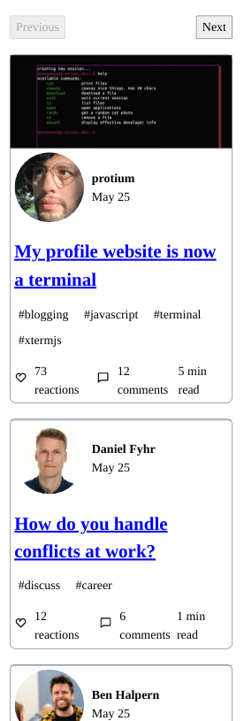
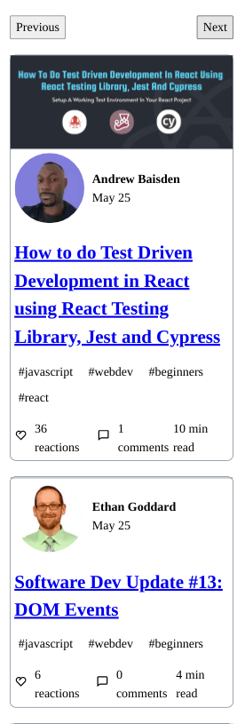
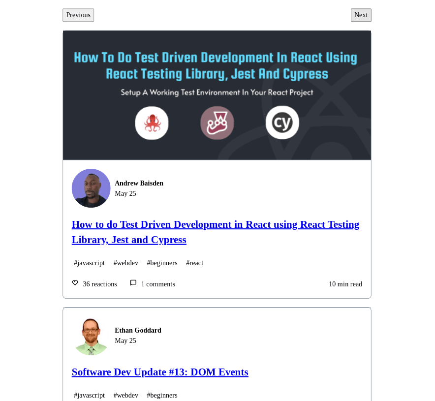
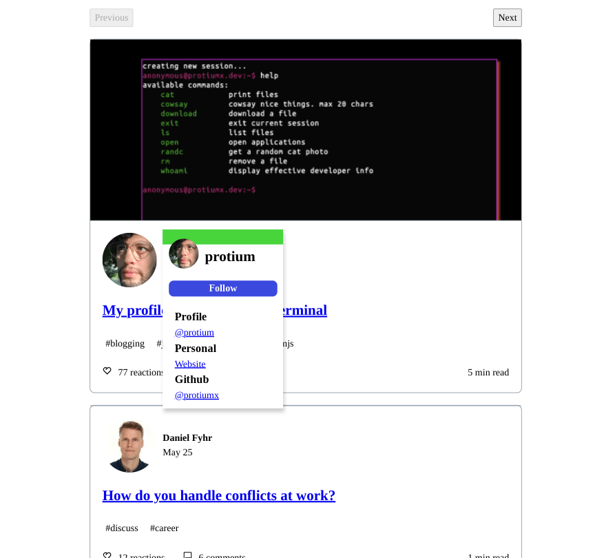
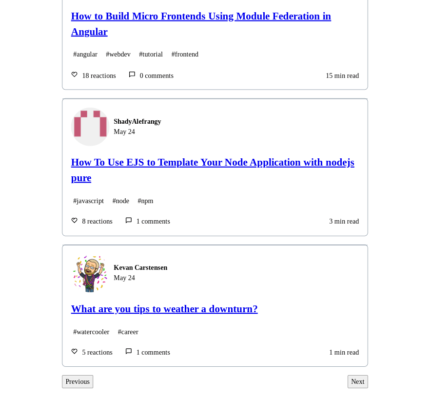

# Dev.to Clone

## Table of contents

- [Overview](#overview)
  - [Screenshots](#screenshots)
  - [Links](#links)
- [My process](#my-process)
  - [Built with](#built-with)
  - [Continued development](#continued-development)
  - [Useful resources](#useful-resources)

## Overview

Project based on this [tutorial](https://www.youtube.com/watch?v=njOk7y62dt0).  I didn't know Dev.to had an api and I was intrigued to see how to use it.  Watching the video, I thought react query would be a perfect fit so I implemented the basic design with it.  I made my hover card closer to the dev-to design.  I didn't see much reason to use tailwind here since project uses minimal css so I omitted it.

### Screenshots

***

***

***

***

### Links

- Live Site URL: [Github Pages](https://jdegand.github.io/dev-to-clone)

## My process

### Built with

- [Create React App](https://github.com/facebook/create-react-app)
- [React](https://reactjs.org)
- [React Query](https://react-query.tanstack.com)
- [Dev.to API](https://developers.forem.com/api#operation/getArticles)
- [React Icons](https://react-icons.github.io/react-icons)
- [Vite](https://vitejs.dev/)

### Continued development

- Images didn't span the whole article when width was greater than 1400px (the images are smaller than viewport width). So I added `min-width: 100%` for images.  
- Random color background (on hover card) was crudely implemented. I added `useMemo` to get standard random color, which is reused across pages. When the app is refreshed, the color will change.
- Semantics can be improved.  I used a lot of div wrappers.  
- Tab functionality for the hover card.  
- I originally used a hook for the `useQuery` request, but I changed that later.  So I could try to convert back to a hook.  React query seems to rely on separate hooks for testing.
- I converted from Create React App to Vite. The process is pretty straightforward, but there may be some lingering things that could be tweaked.
- There were some files like `manifest.json` that I was unsure on keeping or not.  In this case, I removed it, but I need to research more into this. I do know the `robots.txt` file is fine in the `public` folder.
- I didn't have any tests in this app, so I removed the previous test dependencies.

### Useful resources

- [React Query](https://react-query.tanstack.com/examples/pagination) - pagination
- [Reddit](https://www.reddit.com/r/webdev/comments/klpm09/react_query_trying_to_do_pagination_but_getting/) - react query pagination
- [React Router](https://v5.reactrouter.com/web/guides/scroll-restoration) - scroll restoration
- [Blog](https://www.carlrippon.com/lazy-loading-with-react-query/) - lazy loading with react query
- [CSS Tricks](https://css-tricks.com/snippets/javascript/random-hex-color/#:~:text=var%20randomColor%20%3D%20Math.,random()*16777215) - random color
- [Stack Overflow](https://stackoverflow.com/questions/53878153/randomly-change-the-background-color-of-a-react-app-by-a-click) - random bg color
- [Access Use](https://accessuse.eu/en/Content-hover-focus.html) - accessibility hover & focus problems
